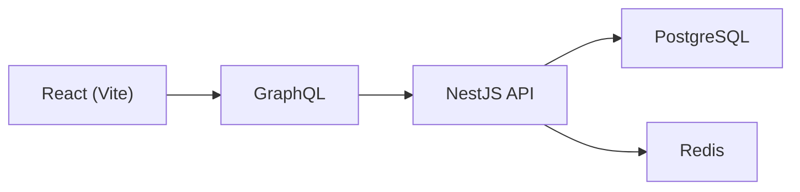

# System architecture

Modular monolith: React client → NestJS GraphQL API over PostgreSQL (system of record) and Redis (optimization).

## System diagram

PostgreSQL is the authoritative source of truth. Redis is non-authoritative — used for caching and rate limiting, not for business decisions. See [Redis caching & rate-limit strategy](redis-caching-strategy.md) for detail.

## Overview

- React is the only frontend.
- GraphQL is the API boundary.
- NestJS API hosts the application layer and orchestrates business operations; domain rules may live in `packages/domain`.
- PostgreSQL is the system of record.
- Redis is an optimization layer, not the source of truth.

## Monorepo layout

| Path                                                   | Role                               |
| ------------------------------------------------------ | ---------------------------------- |
| `apps/web`                                             | React + Vite frontend              |
| `apps/api`                                             | NestJS + Prisma + GraphQL          |
| `packages/domain`                                      | Framework-independent domain logic |
| `packages/types`                                       | Non-domain shared contracts        |
| `packages/typescript-config`, `packages/eslint-config` | Shared tooling configuration       |

`packages/domain` is framework-independent. Infrastructure (Prisma, Redis, GraphQL, NestJS modules) stays in `apps/api`.

## Request paths

High-level component paths for current GraphQL operations (not middleware ordering):

**Catalog/read:** Web → GraphQL (`flashSales`, `flashSale`) → Flash Sale module → Prisma → PostgreSQL (with Redis used where applicable for caching).

**Purchase:** Web → GraphQL (`purchaseItem`) → Purchase module → PostgreSQL transaction (with Redis used where applicable for rate limiting or cache invalidation).

Additional read operations (`myPurchase`, `myPurchases`) follow the same architecture, with Redis used only where the current implementation applies caching.

## Related docs

- [Concurrency model](concurrency-model.md)
- [Fault tolerance strategy](fault-tolerance-strategy.md)
- [Local development](local-development.md)
- [Purchase sequence](purchase-sequence.md)
- [Redis caching & rate-limit strategy](redis-caching-strategy.md)
- [Scalability strategy](scalability-strategy.md)
- [Technology trade-offs](technology-trade-offs.md)
- [Testing strategy](testing-strategy.md)
