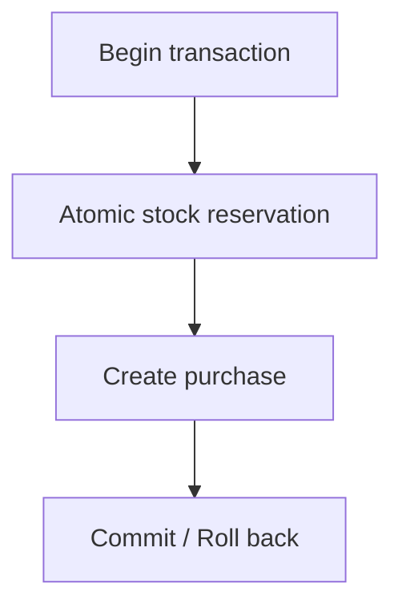

# Concurrency Model

## Overview

- **PostgreSQL is the source of truth** for inventory and purchase records.
- **Purchase correctness is enforced within a single database transaction** — reservation and purchase creation succeed or fail together.
- **Redis is not part of the correctness path** — it accelerates reads and rate-limits traffic but never decides whether a purchase can commit. See [Redis caching & rate-limit strategy](redis-caching-strategy.md).

## Concurrency Control Strategy

The purchase flow relies on two complementary guarantees, both executed inside one PostgreSQL transaction:

1. **Atomic stock reservation** — a conditional update decrements inventory only when stock is available and the sale window is active.
2. **Database-enforced duplicate purchase prevention** — a unique constraint on `(flash_sale_id, user_id)` ensures at most one committed purchase per user per sale.

Neither guarantee depends on Redis, application-level locks, or optimistic versioning. PostgreSQL enforces both before the transaction commits.

## In-transaction flow

The diagram covers only the database transaction boundary. The full Web → GraphQL → Nest → Redis request lifecycle is documented in [Purchase sequence](purchase-sequence.md).

## Concurrency guarantees

### Atomic stock reservation

Reservation succeeds when the conditional update affects **exactly one row**; it fails when **zero rows** are updated.

The current reservation predicates include the active sale window (`starts_at <= now` and `ends_at > now`) and `remaining_stock > 0`. Any condition that is not met at commit time yields zero rows updated, so the attempt fails closed without overselling — whether because stock is exhausted, the sale has not started, or it has ended.

### Duplicate purchase prevention

A database unique invariant on `(flash_sale_id, user_id)` — modeled in Prisma as `@@unique([flashSaleId, userId])` — prevents two committed purchases for the same user and sale. A second concurrent attempt that passes reservation but collides on insert is rejected by the database.

## Failure outcomes

| Outcome               | Cause                                                                                                                                                    |
| --------------------- | -------------------------------------------------------------------------------------------------------------------------------------------------------- |
| `SOLD_OUT`            | Reservation updated zero rows (stock exhausted or sale window not active at commit time).                                                                |
| `ALREADY_PURCHASED`   | Unique constraint conflict on `(flash_sale_id, user_id)` after a successful reservation.                                                                 |
| Consistency preserved | Any rollback — including on unique conflict — leaves inventory and purchase rows consistent; no partial stock decrement without a matching purchase row. |

## Non-goals

This document does not cover:

- End-to-end purchase request lifecycle ([Purchase sequence](purchase-sequence.md))
- Redis keys, TTLs, rate limits, or cache invalidation ([Redis caching & rate-limit strategy](redis-caching-strategy.md))
- Future concurrency mechanisms (distributed locks, queues, optimistic version columns) until implemented
- README expansion or documentation hub work (#73)

## Related documentation

- [System architecture](architecture.md)
- [Redis caching & rate-limit strategy](redis-caching-strategy.md)
- [Purchase sequence](purchase-sequence.md)
