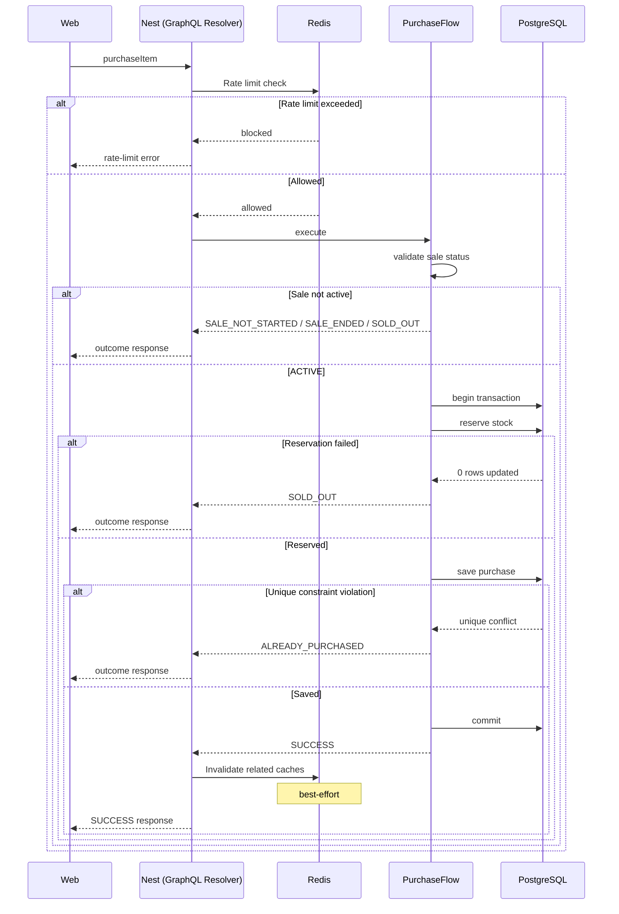

# Purchase sequence

> Describes the server-side lifecycle of a `purchaseItem` request, from GraphQL mutation through transactional purchase processing and response.

## Sequence diagram

> Redis interactions in the sequence are intentionally high level. For cache topology, keys, TTLs, and invalidation strategy, see [Redis caching & rate-limit strategy](redis-caching-strategy.md).

After a successful response, the web application refreshes its local cached data. Client-side cache management is intentionally outside the scope of this server-side sequence.

## Outcomes

| Decision point     | Possible result                                           |
| ------------------ | --------------------------------------------------------- |
| Rate limiter       | Rate-limit error (GraphQL error; not a `PurchaseOutcome`) |
| Sale validation    | `SALE_NOT_STARTED`, `SALE_ENDED`, `SOLD_OUT`              |
| Atomic reservation | `SOLD_OUT`                                                |
| Purchase save      | `ALREADY_PURCHASED`                                       |
| Commit             | `SUCCESS`                                                 |

A missing flash sale throws `FlashSaleNotFoundError` before outcome mapping — this is not shown as a sequence `alt` branch.

## Non-goals

This document does not cover:

- Redis implementation details (keys, TTLs, fail-open behavior)
- Concurrency correctness and transactional guarantees ([Concurrency model](concurrency-model.md))
- Client-side cache refresh (TanStack Query)
- README navigation or onboarding (#73)

## Related documentation

1. [System architecture](architecture.md)
2. [Concurrency model](concurrency-model.md)
3. [Redis caching & rate-limit strategy](redis-caching-strategy.md)
