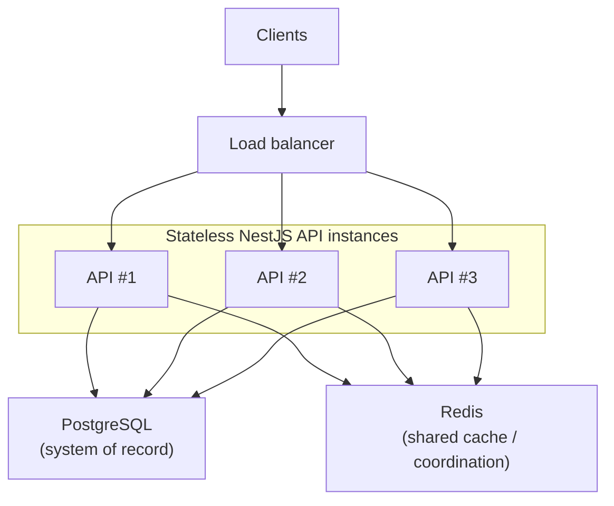

# Scalability Strategy

This document describes the application's horizontal scalability strategy. It explains the intended deployment architecture rather than prescribing a specific production platform.

## Local deployment today

Local Docker Compose provisions **one** NestJS API container for development and demonstration. It is not a production topology.

> The repository's local Docker Compose environment intentionally deploys a single API instance and does not provision a load balancer. The scalability model below describes the application's deployment architecture, not the local development topology.

## Scalability model

Architectural properties that enable horizontal scaling:

- Stateless NestJS API instances
- Shared PostgreSQL as the system of record
- Shared Redis deployment for cross-instance cache and coordination where applicable
- Requests may be served by any API instance

Because of these properties, multiple identical API instances can run behind a load balancer without changing application logic.

## Conceptual production topology

Conceptual production deployment topology. Local Docker Compose intentionally runs a single API instance without a load balancer.

## Why the API is stateless

- No in-memory / server-side user sessions for request routing.
- No affinity (“sticky sessions”) required.
- Any instance can serve any request.

Demo client identity is stored in the browser, not in API process memory. This document does not define authentication architecture.

## Shared infrastructure dependencies

All API instances share the same PostgreSQL database and Redis deployment. Because application state is not stored in individual API processes, any instance can handle any request.

- **PostgreSQL** — system of record for inventory and purchases. Correctness under concurrency is documented in [Concurrency model](concurrency-model.md); the purchase request lifecycle is in [Purchase sequence](purchase-sequence.md).
- **Redis** — shared cache and coordination where applicable. Implementation detail lives in [Redis caching & rate-limit strategy](redis-caching-strategy.md).

## Non-goals

This document does not cover:

- Fault tolerance, degradation, retries, or recovery ([Fault tolerance strategy](fault-tolerance-strategy.md))
- Architectural rationale, alternatives, or scaling-limitation essays ([Technology trade-offs](technology-trade-offs.md))
- Redis keys, TTLs, rate-limit algorithms, or fail-open behavior ([Redis caching & rate-limit strategy](redis-caching-strategy.md))
- Purchase concurrency guarantees ([Concurrency model](concurrency-model.md))
- End-to-end purchase request lifecycle ([Purchase sequence](purchase-sequence.md))
- A specific production platform (Kubernetes, ECS, Docker Swarm, etc.)
- README expansion or documentation hub work (#73)

## Related documentation

- [System architecture](architecture.md)
- [Fault tolerance strategy](fault-tolerance-strategy.md)
- [Technology trade-offs](technology-trade-offs.md)
- [Concurrency model](concurrency-model.md)
- [Purchase sequence](purchase-sequence.md)
- [Redis caching & rate-limit strategy](redis-caching-strategy.md)
- [Local development](local-development.md)
