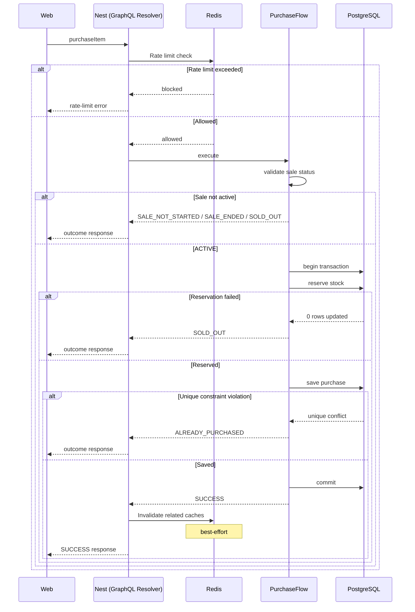

# #62 Purchase Sequence Diagram Implementation Plan

> **For agentic workers:** REQUIRED SUB-SKILL: Use superpowers:subagent-driven-development (recommended) or superpowers:executing-plans to implement this plan task-by-task. Steps use checkbox (`- [ ]`) syntax for tracking.

**Goal:** Add `docs/purchase-sequence.md` with a Mermaid sequence covering the server-side `purchaseItem` lifecycle (including validate → reserve → save purchase → commit), and wire it from the architecture hub and concurrency model.

**Architecture:** Docs-only dedicated sequence doc (Approach A). New canonical purchase-sequence doc; update `docs/architecture.md` Related/Planned navigation; replace planned #62 pointers in `docs/concurrency-model.md` with a live link. Link Redis strategy; do not duplicate it. No README, app, schema, or test changes.

**Tech Stack:** Markdown under `docs/`; Mermaid `sequenceDiagram` in GitHub-flavored markdown.

**Base:** `main` @ `37ac24c` (or later `origin/main` if still fast-forwardable). Working tree must stay limited to #62 doc files plus this plan/spec.

**Commits:** Do **not** commit until the user explicitly asks. Leave changes for review.

**Spec:** `docs/superpowers/specs/2026-07-31-issue-62-purchase-sequence-diagram-design.md`

---

## File map

| File                                                                             | Responsibility                                                                                     |
| -------------------------------------------------------------------------------- | -------------------------------------------------------------------------------------------------- |
| `docs/purchase-sequence.md`                                                      | **Create** — canonical purchase sequence (diagram, Redis note, client note, outcomes, non-goals)   |
| `docs/architecture.md`                                                           | **Modify** — Related docs (alphabetical, include purchase-sequence); remove Planned #62 subsection |
| `docs/concurrency-model.md`                                                      | **Modify** — replace planned/#62-only sequence references with link to `purchase-sequence.md`      |
| `docs/superpowers/specs/2026-07-31-issue-62-purchase-sequence-diagram-design.md` | Already written; update only if implementation reveals an inconsistency                            |
| `docs/superpowers/plans/2026-07-31-issue-62-purchase-sequence-diagram.md`        | This plan                                                                                          |

**Expected unchanged:** `docs/redis-caching-strategy.md`, `docs/local-development.md`, `docs/testing-strategy.md`, `docs/concurrency-model.md` correctness narrative (beyond #62 link updates), `README.md`, `apps/**`, `packages/**`, `e2e/**`, Compose, CI, package scripts.

---

### Task 1: Create `docs/purchase-sequence.md`

**Files:**

- Create: `docs/purchase-sequence.md`

- [x] **Step 1: Write the purchase sequence doc**

Create `docs/purchase-sequence.md` following the approved design. Required sections and intent:

1. **`# Purchase sequence`** (or `# Purchase Sequence` — match title case of sibling docs; architecture links use “Purchase sequence”)
2. **One-liner** (immediately under title):

   > Describes the server-side lifecycle of a `purchaseItem` request, from GraphQL mutation through transactional purchase processing and response.

3. **`## Sequence diagram`** — Mermaid `sequenceDiagram` with participants:

   - `Web`
   - `Nest` as `Nest (GraphQL Resolver)`
   - `Redis`
   - `Flow` as `PurchaseFlow`
   - `PG` as `PostgreSQL`

   Happy path must show **validate → reserve → save purchase → commit**. The AC’s “purchase” step is **saving the Purchase record**; use **save purchase** labeling (not a separate vague “purchase” step).

   Include these `alt` fragments:

   - Rate limit exceeded
   - Sale not active (`SALE_NOT_STARTED` / `SALE_ENDED` / pre-txn `SOLD_OUT`)
   - Reservation failed → `SOLD_OUT`
   - Unique constraint violation → `ALREADY_PURCHASED`

   Keep Redis messages high-level: `Rate limit check`, `Invalidate related caches`. Add a `Note over Redis: best-effort` on invalidation. Do not name keys/TTLs.

   Use this diagram as the baseline (adjust only for Mermaid render quirks; keep semantics):



4. **Redis note** directly under the diagram:

   > Redis interactions in the sequence are intentionally high level. For cache topology, keys, TTLs, and invalidation strategy, see [Redis caching & rate-limit strategy](redis-caching-strategy.md).

5. **Client note** (one sentence, outside the sequence):

   > After a successful response, the web application refreshes its local cached data. Client-side cache management is intentionally outside the scope of this server-side sequence.

6. **`## Outcomes`** — decision-point table:

   | Decision point     | Possible result                                           |
   | ------------------ | --------------------------------------------------------- |
   | Rate limiter       | Rate-limit error (GraphQL error; not a `PurchaseOutcome`) |
   | Sale validation    | `SALE_NOT_STARTED`, `SALE_ENDED`, `SOLD_OUT`              |
   | Atomic reservation | `SOLD_OUT`                                                |
   | Purchase save      | `ALREADY_PURCHASED`                                       |
   | Commit             | `SUCCESS`                                                 |

   Footnote: missing sale throws `FlashSaleNotFoundError` before outcome mapping — not an `alt`.

7. **`## Non-goals`**

   - Redis implementation details (keys, TTLs, fail-open behavior)
   - Concurrency correctness and transactional guarantees (`concurrency-model.md`)
   - Client-side cache refresh (TanStack Query)
   - README navigation or onboarding (#73)

8. **`## Related documentation`** (reading order):

   - [System architecture](architecture.md)
   - [Concurrency model](concurrency-model.md)
   - [Redis caching & rate-limit strategy](redis-caching-strategy.md)

Wording may follow the spec closely but need not be a verbatim paste; prefer clarity and approved intent.

- [x] **Step 2: Sanity-check against current repo**

Confirm documentation matches **current behavior**:

1. `PurchaseResolver.purchaseItem` validates IDs, rate-limits via Redis, calls `PurchaseFlow.execute`, invalidates caches only on `SUCCESS`, returns GraphQL result.
2. `PurchaseFlowService.execute` validates sale status before the transaction; inside `$transaction`: `tryReserve` then `purchaseRepository.save`; unique conflict → `ALREADY_PURCHASED`; zero-row reserve → `SOLD_OUT`.
3. Missing sale throws `FlashSaleNotFoundError` (not a `PurchaseOutcome`).
4. Relative links to `architecture.md`, `concurrency-model.md`, and `redis-caching-strategy.md` resolve.
5. No Redis key/TTL/fail-open duplication beyond the note + link.
6. No client TanStack invalidation steps in the Mermaid diagram.
7. Happy path labels include validate, reserve, save purchase, and commit.

Expected: all checks pass; no code changes required.

---

### Task 2: Update architecture hub navigation

**Files:**

- Modify: `docs/architecture.md` (Related docs / Planned section)

- [x] **Step 1: Promote purchase sequence into Related docs**

Replace the Related docs + Planned block so that:

**Related docs** (alphabetical by title):

- [Concurrency model](concurrency-model.md)
- [Local development](local-development.md)
- [Purchase sequence](purchase-sequence.md)
- [Redis caching & rate-limit strategy](redis-caching-strategy.md)
- [Testing strategy](testing-strategy.md)

**Planned architecture documentation:** remove the entire Planned subsection (it becomes empty once #62 lands).

Do not edit diagram, overview, layout, or request-path sections unless a broken relative link forces a fix (not expected).

Current block for reference (replace entirely):

```markdown
## Related docs

- [Concurrency model](concurrency-model.md)
- [Local development](local-development.md)
- [Redis caching & rate-limit strategy](redis-caching-strategy.md)
- [Testing strategy](testing-strategy.md)

**Planned architecture documentation:**

- Purchase sequence (#62)
```

Target block:

```markdown
## Related docs

- [Concurrency model](concurrency-model.md)
- [Local development](local-development.md)
- [Purchase sequence](purchase-sequence.md)
- [Redis caching & rate-limit strategy](redis-caching-strategy.md)
- [Testing strategy](testing-strategy.md)
```

- [x] **Step 2: Verify hub links**

Confirm `docs/purchase-sequence.md` exists and all Related relative links resolve from `docs/architecture.md`. Confirm no Planned subsection remains.

Expected: hub navigates to the new purchase-sequence doc; no nonexistent file links; no empty Planned heading.

---

### Task 3: Update concurrency model pointers to the live sequence doc

**Files:**

- Modify: `docs/concurrency-model.md`

- [x] **Step 1: Replace planned #62 references with live links**

Update every place that refers to Purchase sequence as planned / issue-only so it links to `purchase-sequence.md`. Current spots:

1. In-transaction flow caption (~line 29): change “Purchase sequence (#62)” to a markdown link `[Purchase sequence](purchase-sequence.md)`.
2. Non-goals bullet (~line 55): same — link the doc; keep the “not covered here” meaning.
3. Related documentation (~line 64): change `Purchase sequence (#62) — planned` to `[Purchase sequence](purchase-sequence.md)`.

Do **not** import the e2e sequence into this file. Do **not** change the in-transaction Mermaid flowchart or concurrency guarantee prose.

- [x] **Step 2: Verify concurrency links**

Confirm relative link `purchase-sequence.md` resolves from `docs/concurrency-model.md`. Confirm no remaining “planned” wording for #62.

Expected: concurrency doc points at the live sequence doc; correctness narrative unchanged.

---

### Task 4: Format and docs-only verification

**Files:**

- Verify: `docs/purchase-sequence.md`, `docs/architecture.md`, `docs/concurrency-model.md`

- [x] **Step 1: Format touched markdown**

Prefer the project’s existing markdown formatting script/package script if one exists; otherwise Prettier on touched files only:

```bash
npx prettier --write \
  docs/purchase-sequence.md \
  docs/architecture.md \
  docs/concurrency-model.md \
  docs/superpowers/specs/2026-07-31-issue-62-purchase-sequence-diagram-design.md \
  docs/superpowers/plans/2026-07-31-issue-62-purchase-sequence-diagram.md
```

Expected: files formatted; no unrelated tree churn.

- [x] **Step 2: Spec checklist**

Walk the design verification list:

1. Mermaid sequence renders and happy path shows validate → reserve → save purchase → commit (AC; “purchase” = save Purchase record)
2. Participants are Web, Nest (GraphQL Resolver), Redis, PurchaseFlow, PostgreSQL — no separate GraphQL lifeline
3. Four agreed `alt` fragments present; outcome table grouped by decision point; Purchase save row used
4. Redis note + strategy link present; no keys/TTLs/fail-open duplication
5. Client cache note is one sentence outside the sequence; no TanStack detail
6. `architecture.md` Related includes purchase-sequence alphabetically; Planned subsection removed
7. `concurrency-model.md` links live `purchase-sequence.md` (no “planned” wording for #62)
8. README unchanged
9. No app/schema/test changes in the diff
10. Prettier (or repo format check) on touched markdown only

- [x] **Step 3: Do not commit**

Stop for user review. Do **not** `git commit` unless the user explicitly asks. Leave changes uncommitted.

---

## Spec coverage

| Spec requirement                                     | Task |
| ---------------------------------------------------- | ---- |
| Create `docs/purchase-sequence.md` (Approach A body) | 1    |
| AC: validate → reserve → purchase(save) → commit     | 1    |
| Mermaid e2e sequence + four alts                     | 1    |
| Redis high-level note + client note + outcome table  | 1    |
| Non-goals + Related docs                             | 1    |
| Architecture Related/Planned hub update              | 2    |
| Concurrency model live link updates                  | 3    |
| Docs-only verification; no commit                    | 4    |

## Out of scope reminder

Do not start #73, #71, or #74. Do not reopen #134 CSS AC. Do not expand README into a documentation hub. Do not edit Redis strategy content. Do not invent behavior not present in the current purchase path.
