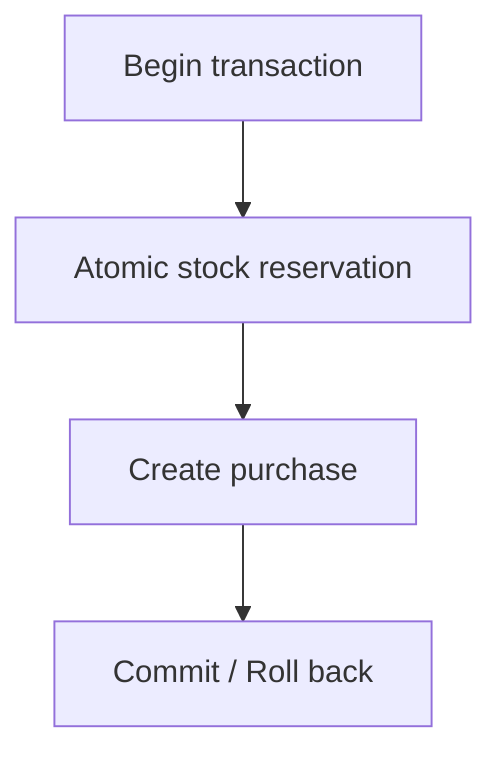

# #63 Concurrency Model Implementation Plan

> **For agentic workers:** REQUIRED SUB-SKILL: Use superpowers:subagent-driven-development (recommended) or superpowers:executing-plans to implement this plan task-by-task. Steps use checkbox (`- [ ]`) syntax for tracking.

**Goal:** Add `docs/concurrency-model.md` explaining atomic reservation and unique purchase constraint as concurrency correctness guarantees, and link it from the architecture hub.

**Architecture:** Docs-only focused model hub (Approach B). New canonical concurrency doc; update `docs/architecture.md` Related/Planned navigation. Link Redis strategy; do not duplicate it. Leave purchase sequence to #62. No README, app, schema, or test changes.

**Tech Stack:** Markdown under `docs/`; Mermaid in GitHub-flavored markdown.

**Base:** `main` @ `54e5f64` (or later `origin/main` if still fast-forwardable). Working tree must stay limited to #63 doc files plus this plan/spec.

**Commits:** Do **not** commit until the user explicitly asks. Leave changes for review.

**Spec:** `docs/superpowers/specs/2026-07-31-issue-63-concurrency-model-design.md`

---

## File map

| File                                                                     | Responsibility                                                                                       |
| ------------------------------------------------------------------------ | ---------------------------------------------------------------------------------------------------- |
| `docs/concurrency-model.md`                                              | **Create** — canonical concurrency model (overview, strategy, flow, guarantees, outcomes, non-goals) |
| `docs/architecture.md`                                                   | **Modify** — Related docs (alphabetical, include concurrency); Planned = #62 only                    |
| `docs/superpowers/specs/2026-07-31-issue-63-concurrency-model-design.md` | Already written; update only if implementation reveals an inconsistency                              |
| `docs/superpowers/plans/2026-07-31-issue-63-concurrency-model.md`        | This plan                                                                                            |

**Expected unchanged:** `docs/redis-caching-strategy.md`, `docs/local-development.md`, `README.md`, `apps/**`, `packages/**`, `e2e/**`, Compose, CI, package scripts.

---

### Task 1: Create `docs/concurrency-model.md`

**Files:**

- Create: `docs/concurrency-model.md`

- [x] **Step 1: Write the concurrency model doc**

Create `docs/concurrency-model.md` following the approved design. Required sections and intent:

1. **`# Concurrency Model`**
2. **Overview** — exactly three ideas: PostgreSQL is SoT; purchase correctness in a single DB transaction; Redis is not on the correctness path (link `redis-caching-strategy.md`).
3. **`## Concurrency Control Strategy`** — Introduce the two guarantees up front:
   1. Atomic stock reservation
   2. Database-enforced duplicate purchase prevention  
      State that both run inside one PostgreSQL transaction.
4. **`## In-transaction flow`** — Mermaid flowchart only (no SQL):



Add a short caption that the full Web → GraphQL → Nest → Redis lifecycle is Purchase sequence (#62). Do **not** link `purchase-sequence.md`.

5. **`## Concurrency guarantees`**
   - Atomic reservation: success = conditional update affects **exactly one row**; failure = **zero rows**. Note that current predicates include the active sale window and `remaining_stock > 0`, framed via one-row vs zero-rows (no SQL block).
   - Duplicate prevention: unique invariant on `(flash_sale_id, user_id)` / Prisma `@@unique([flashSaleId, userId])`.
6. **`## Failure outcomes`** — outcome-level only:
   - Zero-row reservation → `SOLD_OUT`
   - Unique conflict → `ALREADY_PURCHASED`
   - Rollback preserves consistency
7. **`## Non-goals`** — #62 lifecycle; Redis internals; future unimplemented mechanisms; README/#73
8. **`## Related documentation`**
   - [System architecture](architecture.md)
   - [Redis caching & rate-limit strategy](redis-caching-strategy.md)
   - Purchase sequence (#62) — planned

Wording may follow the spec closely but need not be a verbatim paste; prefer clarity and approved intent.

- [x] **Step 2: Sanity-check against current repo**

Confirm documentation matches **current behavior** (prefer behavior over brittle implementation prescriptions):

1. Purchase flow performs reservation and purchase creation within a single PostgreSQL transaction (today: `PurchaseFlowService.execute` + `prisma.$transaction`).
2. Reservation succeeds only when exactly one row is affected; otherwise it fails closed for that attempt.
3. Duplicate purchases for the same sale+user are rejected by a database unique invariant on `(flash_sale_id, user_id)` (today: Prisma `@@unique([flashSaleId, userId])`).
4. Relative links to `architecture.md` and `redis-caching-strategy.md` resolve.
5. No link target `purchase-sequence.md`.
6. No Redis key/TTL/rate-limit duplication beyond the overview pointer.

Expected: all checks pass; no code changes required.

---

### Task 2: Update architecture hub navigation

**Files:**

- Modify: `docs/architecture.md` (Related docs / Planned section)

- [x] **Step 1: Move concurrency into Related docs**

Replace the Related docs + Planned block so that:

**Related docs** (alphabetical by title):

- [Concurrency model](concurrency-model.md)
- [Local development](local-development.md)
- [Redis caching & rate-limit strategy](redis-caching-strategy.md)

**Planned architecture documentation:**

- Purchase sequence (#62)

Remove “Concurrency model (#63)” from Planned. Do not edit diagram, overview, layout, or request-path sections unless a broken relative link forces a fix (not expected).

Current block for reference (replace entirely):

```markdown
## Related docs

- [Redis caching & rate-limit strategy](redis-caching-strategy.md)
- [Local development](local-development.md)

**Planned architecture documentation:**

- Purchase sequence (#62)
- Concurrency model (#63)
```

Target block:

```markdown
## Related docs

- [Concurrency model](concurrency-model.md)
- [Local development](local-development.md)
- [Redis caching & rate-limit strategy](redis-caching-strategy.md)

**Planned architecture documentation:**

- Purchase sequence (#62)
```

- [x] **Step 2: Verify hub links**

Confirm `docs/concurrency-model.md` exists and all three Related relative links resolve from `docs/architecture.md`. Confirm Planned mentions only #62.

Expected: hub navigates to the new concurrency doc; no nonexistent file links.

---

### Task 3: Format and docs-only verification

**Files:**

- Verify: `docs/concurrency-model.md`, `docs/architecture.md`

- [x] **Step 1: Format touched markdown**

Prefer the project’s existing markdown formatting script/package script if one exists; otherwise Prettier on touched files only is fine as guidance. Format only the #63 markdown files.

```bash
# Prefer repo script if present, e.g. package.json "format" / "format:docs"
# Fallback:
npx prettier --write docs/concurrency-model.md docs/architecture.md docs/superpowers/specs/2026-07-31-issue-63-concurrency-model-design.md docs/superpowers/plans/2026-07-31-issue-63-concurrency-model.md
```

Expected: files formatted; no unrelated tree churn.

- [x] **Step 2: Spec checklist**

Walk the design verification list:

1. Overview contains only the three framing points (PostgreSQL SoT, single-transaction correctness, Redis not on correctness path)
2. AC covered under Concurrency Control Strategy
3. Mermaid is in-txn only
4. One-row / zero-rows framing; no SQL
5. Outcomes are `SOLD_OUT` / `ALREADY_PURCHASED` / rollback
6. No Redis strategy duplication
7. No `purchase-sequence.md` link
8. Architecture Related alphabetical by title + Planned = #62 only
9. README untouched
10. No app/schema/test changes in the diff

- [x] **Step 3: Do not commit**

Stop for user review. Do **not** `git commit` unless the user explicitly asks. Leave changes uncommitted.

---

## Spec coverage

| Spec requirement                                      | Task |
| ----------------------------------------------------- | ---- |
| Create `docs/concurrency-model.md` (Approach B body)  | 1    |
| AC: atomic reservation + unique constraint guarantees | 1    |
| Mermaid in-txn flow; no SQL                           | 1    |
| Failure outcomes outcome-level                        | 1    |
| Non-goals + Related docs                              | 1    |
| Architecture Related/Planned hub update               | 2    |
| Docs-only verification; no commit                     | 3    |

## Out of scope reminder

Do not start #62, #68, #73, #71, or #74. Do not reopen #134 CSS AC. Do not expand README into a documentation hub. Do not edit Redis strategy content.
