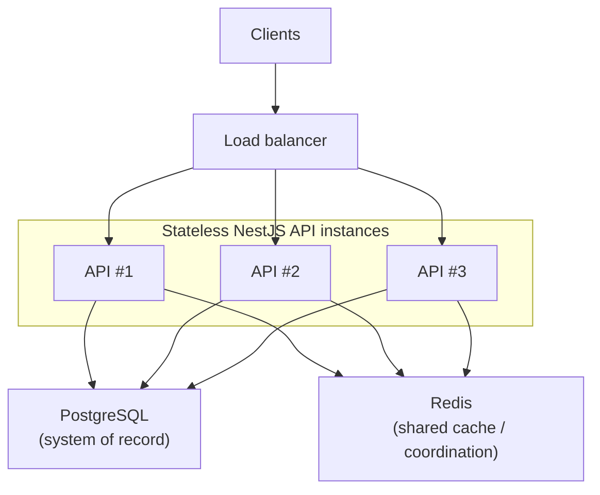

# #64 Scalability Strategy Implementation Plan

> **For agentic workers:** REQUIRED SUB-SKILL: Use superpowers:subagent-driven-development (recommended) or superpowers:executing-plans to implement this plan task-by-task. Steps use checkbox (`- [ ]`) syntax for tracking.

**Goal:** Add `docs/scalability-strategy.md` documenting the horizontal scalability model (stateless NestJS API instances behind a load balancer with shared PostgreSQL + Redis), and link it from the architecture hub.

**Architecture:** Docs-only focused strategy doc (Approach 1). New canonical scalability-strategy doc; update `docs/architecture.md` Related docs (alphabetical). Distinguish intended production topology from single-instance Compose. Leave fault tolerance to #65, trade-offs to #66, Redis/concurrency/purchase-sequence detail to existing docs, README to #73. No app, schema, CI, Compose, or test changes.

**Tech Stack:** Markdown under `docs/` (Mermaid diagrams, GitHub-native).

**Base:** `main` @ `24e9bb9` (or later `origin/main` if still fast-forwardable). Working tree must stay limited to #64 doc files plus this plan/spec.

**Commits:** Do **not** commit until the user explicitly asks. Leave changes for review.

**Spec:** `docs/superpowers/specs/2026-07-31-issue-64-scalability-strategy-design.md`

---

## File map

| File                                                                        | Responsibility                                                                                          |
| --------------------------------------------------------------------------- | ------------------------------------------------------------------------------------------------------- |
| `docs/scalability-strategy.md`                                              | **Create** — canonical horizontal-scaling / deployment strategy                                         |
| `docs/architecture.md`                                                      | **Modify** — Related docs alphabetical, include Scalability strategy; no Planned entry for #64          |
| `docs/superpowers/specs/2026-07-31-issue-64-scalability-strategy-design.md` | Already written (editorial refinements applied); update only if implementation reveals an inconsistency |
| `docs/superpowers/plans/2026-07-31-issue-64-scalability-strategy.md`        | This plan                                                                                               |

**Expected unchanged:** `docs/concurrency-model.md`, `docs/redis-caching-strategy.md`, `docs/purchase-sequence.md`, `docs/local-development.md`, `docs/testing-strategy.md`, `README.md`, `apps/**`, `packages/**`, `e2e/**`, Compose, CI, package scripts.

**Related-docs ordering rule:** `docs/scalability-strategy.md` orders related documents by recommended reading flow. `docs/architecture.md` orders related documents alphabetically as the documentation hub. Do not “fix” one ordering to match the other.

---

### Task 1: Create `docs/scalability-strategy.md`

**Files:**

- Create: `docs/scalability-strategy.md`

- [x] **Step 1: Write the scalability strategy doc**

Create `docs/scalability-strategy.md` with the following content (wording may be tightened for clarity; do not change structure, AC topology, honesty note, or ownership boundaries):

````markdown
# Scalability Strategy

This document describes the application's horizontal scalability strategy. It explains the intended deployment architecture rather than prescribing a specific production platform.

## Local deployment today

Local Docker Compose provisions **one** NestJS API container for development and demonstration. It is not a production topology.

> The repository's local Docker Compose environment intentionally deploys a single API instance and does not provision a load balancer. The scalability model below describes the application's deployment architecture, not the local development topology.

## Scalability model

Architectural properties that enable horizontal scaling:

- Stateless NestJS API instances
- Shared PostgreSQL as the system of record
- Shared Redis deployment for cross-instance cache and coordination where applicable
- Requests may be served by any API instance

Because of these properties, multiple identical API instances can run behind a load balancer without changing application logic.

## Conceptual production topology

Conceptual production deployment topology. Local Docker Compose intentionally runs a single API instance without a load balancer.



## Why the API is stateless

- No in-memory / server-side user sessions for request routing.
- No affinity (“sticky sessions”) required.
- Any instance can serve any request.

Demo client identity is stored in the browser, not in API process memory. This document does not define authentication architecture.

## Shared infrastructure dependencies

All API instances share the same PostgreSQL database and Redis deployment. Because application state is not stored in individual API processes, any instance can handle any request.

- **PostgreSQL** — system of record for inventory and purchases. Correctness under concurrency is documented in [Concurrency model](concurrency-model.md); the purchase request lifecycle is in [Purchase sequence](purchase-sequence.md).
- **Redis** — shared cache and coordination where applicable. Implementation detail lives in [Redis caching & rate-limit strategy](redis-caching-strategy.md).

## Non-goals

This document does not cover:

- Fault tolerance, degradation, retries, or recovery (Issue #65)
- Architectural rationale, alternatives, or scaling-limitation essays (Issue #66)
- Redis keys, TTLs, rate-limit algorithms, or fail-open behavior ([Redis caching & rate-limit strategy](redis-caching-strategy.md))
- Purchase concurrency guarantees ([Concurrency model](concurrency-model.md))
- End-to-end purchase request lifecycle ([Purchase sequence](purchase-sequence.md))
- A specific production platform (Kubernetes, ECS, Docker Swarm, etc.)
- README expansion or documentation hub work (#73)

## Related documentation

- [System architecture](architecture.md)
- [Concurrency model](concurrency-model.md)
- [Purchase sequence](purchase-sequence.md)
- [Redis caching & rate-limit strategy](redis-caching-strategy.md)
- [Local development](local-development.md)

**Planned work**

- Issue #65 — Fault tolerance strategy
- Issue #66 — Technology / architecture trade-offs
````

- [x] **Step 2: Sanity-check the new doc**

Confirm:

1. File exists at `docs/scalability-strategy.md`.
2. Purpose sentence distinguishes strategy from prescribing a production platform.
3. Honesty note is present and matches the design (Compose = single API, no LB).
4. Mermaid includes Clients → Load balancer → API subgraph (#1/#2/#3) → PostgreSQL + Redis.
5. Section heading is **Shared infrastructure dependencies** (not a shortened variant).
6. Related docs follow reader progression (architecture → concurrency → purchase sequence → Redis → local development), then Planned #65/#66 by issue number only.
7. No Kubernetes / ECS / Swarm prescription; no Redis keys/TTLs; no reservation SQL; no README edits.

Expected: lean deployment-strategy doc that satisfies #64 AC without scope creep.

---

### Task 2: Link from architecture hub

**Files:**

- Modify: `docs/architecture.md` (Related docs section only)

- [x] **Step 1: Add Scalability strategy to Related docs**

Replace the Related docs block so titles remain alphabetical. Current `main` Related docs (after #62 / #68 / #151) for reference:

```markdown
## Related docs

- [Concurrency model](concurrency-model.md)
- [Local development](local-development.md)
- [Purchase sequence](purchase-sequence.md)
- [Redis caching & rate-limit strategy](redis-caching-strategy.md)
- [Testing strategy](testing-strategy.md)
```

Target block:

```markdown
## Related docs

- [Concurrency model](concurrency-model.md)
- [Local development](local-development.md)
- [Purchase sequence](purchase-sequence.md)
- [Redis caching & rate-limit strategy](redis-caching-strategy.md)
- [Scalability strategy](scalability-strategy.md)
- [Testing strategy](testing-strategy.md)
```

Do **not** edit the system diagram, overview, layout, or request-path sections. Do **not** add a Planned entry for #64. If a Planned section exists and lists only unfinished work, leave it unchanged (or keep empty / omit — Planned contains only documents that have not yet been implemented). Do not add #65/#66 under architecture Planned.

- [x] **Step 2: Verify hub links**

Confirm `docs/scalability-strategy.md` exists and the new Related relative link resolves from `docs/architecture.md`. Confirm Related titles are alphabetical. Confirm there is **no duplicate** "Scalability strategy" entry. Confirm `README.md` is untouched.

Expected: hub navigates to the new scalability strategy doc exactly once; no nonexistent file links; README unchanged.

---

### Task 3: Format and docs-only verification

**Files:**

- Verify: `docs/scalability-strategy.md`, `docs/architecture.md`

- [x] **Step 1: Format touched markdown**

```bash
npx prettier --write \
  docs/scalability-strategy.md \
  docs/architecture.md \
  docs/superpowers/specs/2026-07-31-issue-64-scalability-strategy-design.md \
  docs/superpowers/plans/2026-07-31-issue-64-scalability-strategy.md
```

Expected: files formatted; no unrelated tree churn.

- [x] **Step 2: Spec checklist**

Walk the design verification list in document flow order:

1. Purpose sentence distinguishes strategy from prescribing a production platform
2. Honesty note states Compose is single-API and has no load balancer
3. Mermaid shows Clients → Load balancer → multiple API instances → shared PostgreSQL + Redis (AC)
4. Stateless section stays at three bullets (no AuthN deep-dive)
5. **Shared infrastructure dependencies** stays at dependency level (no Redis keys/TTLs, no reservation SQL); no Redis/concurrency/purchase-sequence duplication beyond one-sentence summaries + links
6. Related docs use reader progression (architecture → concurrency → purchase sequence → Redis → local development)
7. Planned pointers for #65/#66 use issue numbers only until those docs exist
8. No section prescribes Kubernetes, ECS, Docker Swarm, or any specific production deployment platform
9. Caption is plain prose distinguishing conceptual production topology from single-instance Compose
10. Ordering rules hold: scalability-strategy = reader progression; architecture Related = alphabetical with Scalability strategy exactly once; README unchanged
11. Docs-only diff — no app/schema/Compose/CI/test changes

- [x] **Step 3: Do not commit**

Stop for user review. Do **not** `git commit` unless the user explicitly asks. Leave changes uncommitted.

---

## Spec coverage

| Spec requirement                                                        | Task |
| ----------------------------------------------------------------------- | ---- |
| Create `docs/scalability-strategy.md` (Approach 1 body)                 | 1    |
| AC: stateless API instances behind a load balancer (Mermaid + model)    | 1    |
| Honesty note: Compose single API, no LB                                 | 1    |
| Purpose: strategy vs production platform                                | 1    |
| Shared infra at dependency level; Redis/concurrency/purchase links only | 1    |
| Subgraph Mermaid; polished caption                                      | 1    |
| Related docs reader progression + Planned #65/#66                       | 1    |
| Architecture Related hub update (alphabetical)                          | 2    |
| No K8s/ECS/Swarm prescription; docs-only verification; no commit        | 3    |

## Out of scope reminder

Do not start #65, #66, #69, #70, #71, #73, or EPIC-07. Do not reopen #134 CSS AC. Do not expand README into a documentation hub. Do not edit Redis strategy, concurrency-model, or purchase-sequence content beyond inbound links from the new doc. Do not modify existing documentation solely to add reciprocal links unless required by this plan. Do not invent multi-instance Compose or cloud deployment manifests.
